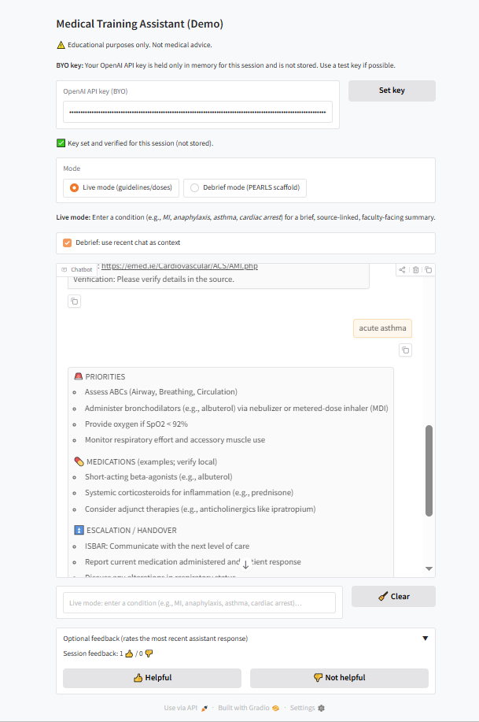
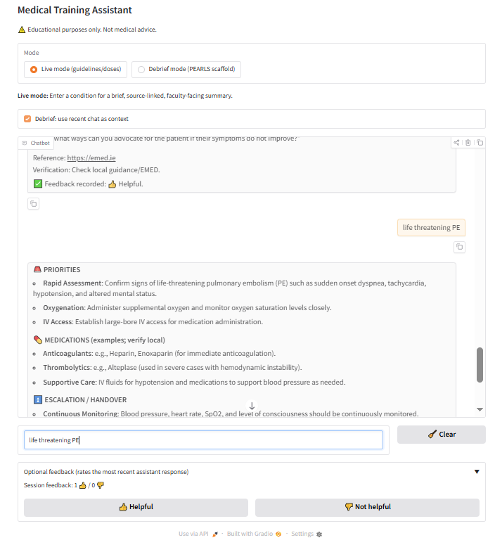
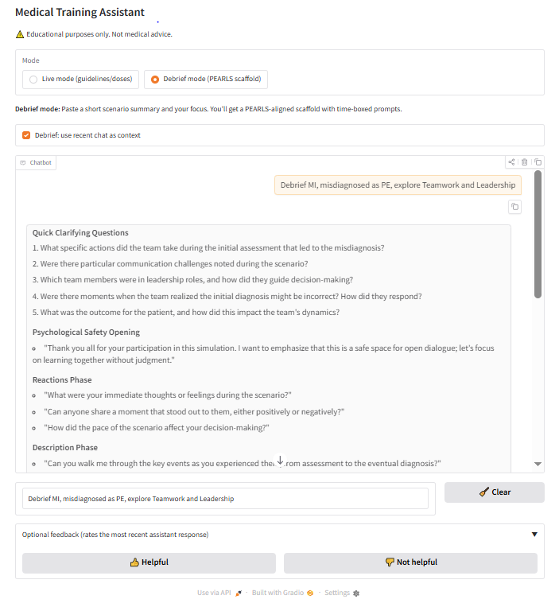
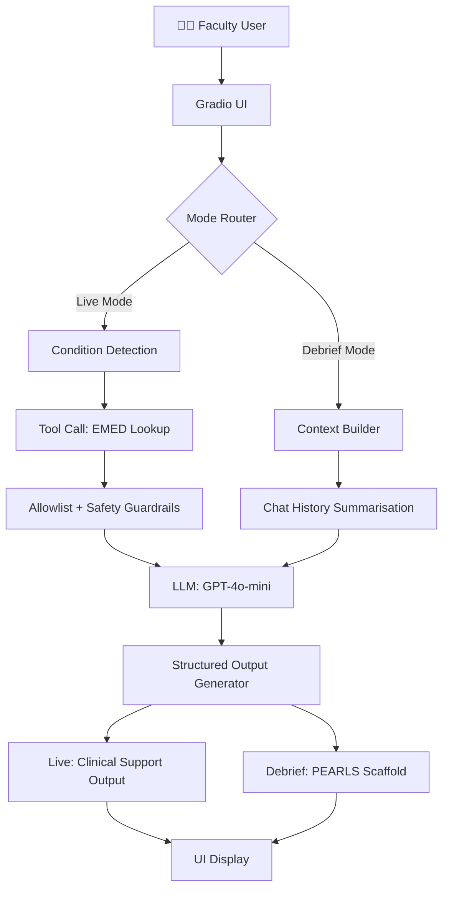

# 🧠 Generative AI Faculty Assistant for Clinical Simulation

---

## 📌 Overview

This project presents a **faculty-facing generative AI assistant** designed to support **live clinical simulation delivery and debriefing**.

High-fidelity simulation places significant cognitive demands on faculty, particularly during emergency scenarios where facilitators must simultaneously manage:
- clinical accuracy  
- scenario flow  
- learner support  
- debrief preparation  

This tool provides **just-in-time support** during live simulation and structured guidance during debriefing, without disrupting scenario delivery.

---

## 🚀 Live Demo

👉 **Try the live application:**  
https://huggingface.co/spaces/2O24dpower2024/faculty-assist

---

## 🎯 Motivation

Most applications of generative AI in medical education are:
- learner-facing (e.g. tutoring)
- post-session content generation

There is **limited practical reporting of AI tools supporting faculty during live simulation**.

This project addresses that gap by providing:
- real-time clinical support  
- structured debrief scaffolding  
- low-friction integration into live simulation workflows  

---

## ⚙️ System Design

The application is built around a large language model accessed via API and structured prompt design.

It operates in **two modes**:

---

### 🔴 1. Live Support Mode (During Simulation)

Faculty can enter a clinical condition or query to receive:

- immediate actions  
- escalation guidance  
- drug treatments and dosing (when appropriate)  
- structured prompts for facilitation  

#### 🛡️ Safety Features

- Responses grounded to **allowlisted trusted sources (EMED)**  
- Explicit **source citation prompts**  
- Redirect behaviour for unsupported conditions  
- No autonomous decision-making  
- **Human-in-the-loop control at all times**
  

---

### 🔵 2. Debrief Mode (Post-Scenario)

Faculty input:
- a brief scenario summary  
- debrief focus  

The system generates a structured scaffold aligned with the **PEARLS framework**, including:

- opening script (psychological safety)  
- reaction and description questions  
- advocacy–inquiry prompts  
- targeted teaching points  
- take-home messages  
- optional **5-minute debrief format**

---

## 🧪 Evaluation

This system was evaluated as a **feasibility and usability pilot** during emergency simulation courses for newly qualified doctors.

### Key findings:

- Feasible to use **during live simulation**
- Did not disrupt **scenario flow**
- Supported:
  - clinical confirmation  
  - escalation prompts  
  - structured debriefing  
- Particularly valuable for **less experienced faculty**

Evaluation was based on **faculty feedback during real-world use**, consistent with iterative design approaches in simulation-based education.

- Iteratively tested with simulation faculty (n ≈ 12 full day sessions)
- Positive perceived utility for:
  - junior faculty support
  - debrief structuring
- Future work:
  - formal usability study
  - impact on debrief quality

---

## 🔁 Iterative Development

The system was refined in real time across multiple simulation sessions, with:

- rapid prompt tuning  
- guardrail adjustments  
- interface improvements  

This reflects a **design-based research approach** grounded in practical deployment.

---

## 🧪 Example Use Cases

### Live Simulation Support
Input:
"anaphylaxis"

Output:
- Immediate priorities
- Drug dosing (if grounded)
- Escalation prompts
- Faculty facilitation cues

### Debrief Support
Input:
"learner missed early sepsis recognition"

Output:
- PEARLS scaffold
- Advocacy–Inquiry prompts
- CRM-linked discussion points

---

## 🧠 System Overview

- LLM: GPT-4o-mini
- Tool use: EMED retrieval
- Guardrails:
  - allowlist conditions
  - no dosing unless grounded
- Modes:
  - Live (real-time support)
  - Debrief (PEARLS scaffold)

---

## 🧠 System Architecture

The system integrates a large language model with tool-based retrieval and structured prompting to support faculty across both live simulation and debrief phases.

**Figure 1.** System architecture of a large language model–augmented assistant designed to support faculty during clinical simulation. User input is routed via a mode selection layer to either (1) live clinical support, incorporating condition parsing, tool-based retrieval from a curated knowledge source (EMED), and safety guardrails, or (2) debrief support, incorporating chat history summarisation. Both pathways interface with a large language model (GPT-4o-mini) to generate structured outputs tailored to simulation delivery or PEARLS-aligned debriefing. Outputs are formatted and returned to the user interface. EMED: www.emed.ie; PEARLS: Promoting Excellence And Reflective Learning in Simulation.

---

## 📄 Related Work

This project builds on broader research into **multi-agent and generative AI systems in clinical simulation**:

- Power, D., & Power, T. (2026). *Can Large Language Models Simulate the Clinical Conversation? A Multi-Agent Approach*  
  https://doi.org/10.35542/osf.io/etv6d_v1

---

## 📖 Preprint

A short report describing this work is currently under review:

- Power, D. (2026). *Generative AI Support for Faculty During Live Simulation*  

https://doi.org/10.35542/osf.io/p3fyc_v1

---

## 🧠 Research Context

This work forms part of an ongoing research programme focused on:

- AI-supported clinical simulation  
- multi-agent LLM systems  
- structured communication and escalation  
- simulation faculty support tools  

## 📜 Citation

If you use this work, please consider citing the associated research:

Power, D. (2026). *Generative AI Support for Faculty During Live Simulation.* (Under review)

---

## 📜 Licensing

- Code is released under the MIT License
- Dataset is released under CC BY 4.0

Please cite appropriately when using the dataset.

---

## 👤 Author

David Power  
Healthcare Simulation Specialist | MSc Artificial Intelligence  

- 💼 LinkedIn: https://www.linkedin.com/in/dave-power-47280a44/  
- 💻 GitHub: https://github.com/DavePower-cloud

